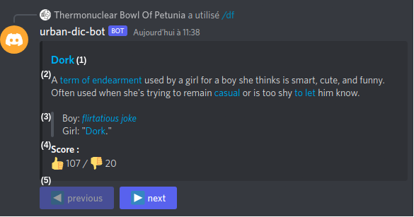

# Urban Dictionary Bot

A bot to quicly get the colloquial definition of a word from the site urban dictionary.

## Install 

### Creating the application and the bot

I recommend following discord's [getting started guide](https://discord.com/developers/docs/getting-started) to create the bot and the url used to add the bot to the server.

This bot require the following scope : 
- bot with the permisions
    - Send Messages
    - Use Slash Commands
- applications.commands

### Launching the bot

#### With the source

You will need to have the rust toolchain installed to run the bot from the source. If you dont have it follow the [rust doc](https://www.rust-lang.org/tools/install)

Once you have your toolchain up to date clone the project :
```sh
git clone urban-dic-bot
cd urban-dic-bot
```
Set the DISCORD_TOKEN environement variable in `.env` :
```sh
cp .env.example .env
nano .env
```
Start the bot : 
```sh
cargo run --release
```

## Usage 

### Command

```
/df <word>
 - word(string) : the word you want to be described
```
### The result



1. The world with a link that redirects you to the Urban Dictionary page
2. The defintion of the word with the links to the referenced words in it
3. An example of the word used in it's context
4. The score given to the definition 
5. Buttons that allow you to explore the different definiton for the word (note : the buttons will be disabled 10 minutes after the command is called due to discord limitations)